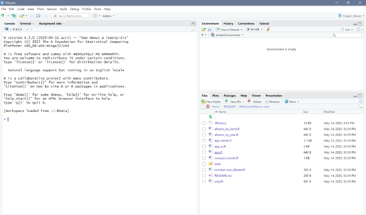

# Downloading RStudio

> In order to run MyFavoriteAlbums, you need to install RStudio. RStudio helps run the code and run the shiny application. 

1. Navigate to the [RStudio Download Page](https://posit.co/download/rstudio-desktop/). 
2. Download R and Rstudio for your machine. 
3. Once downloaded, click on the files and click through the setup details. 
    
  
     After you have accepted all of the set up details you should be met with a screen similar to this.

  

