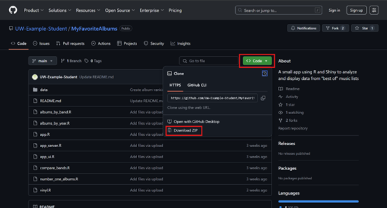

# Downloading Files From GitHub 

1. Navigate to the GitHub Repo to [MyFavoriteAlbums](https://github.com/UW-Example-Student/MyFavoriteAlbums)
2. Click the green **Code** drop button. 
3. Click **Download ZIP**. 

4. Extract the ZIP file to your preferred folder. 

