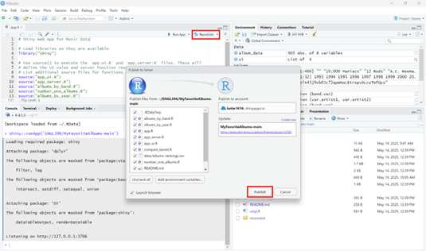

# Republishing The App 

> Once you have synced your RStudio and Shiny App and published the application once you will need to republish the application. Republishing your app will be necessary every time you update your code or your CSV file. 

1. Click the Republish button and publish the application. 

