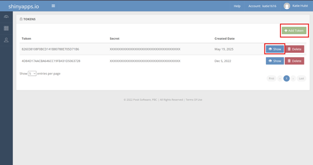
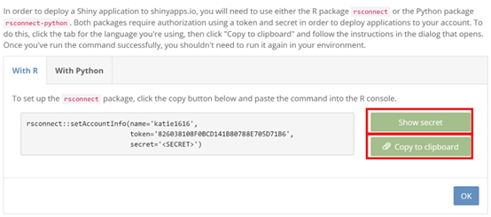
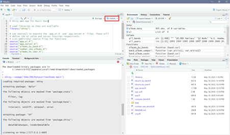
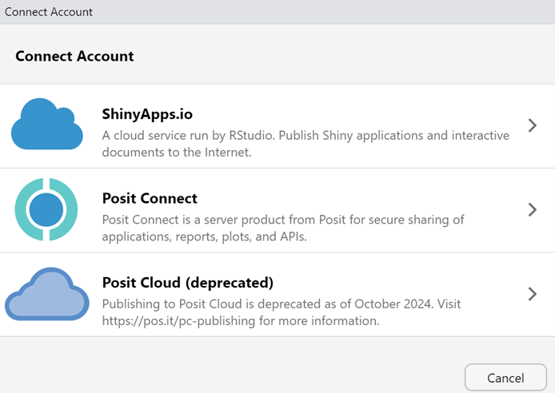
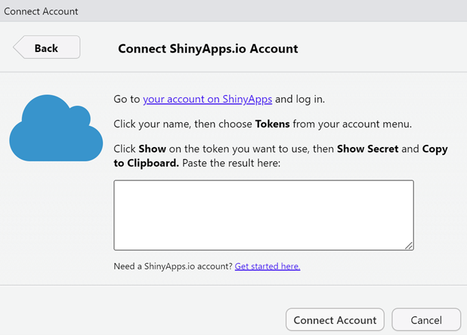

# Syncing Shiny and RStudio 

> To publish your app you need to sync your Shiny account and your RStudio.

1. Create a [Shiny Account](https://www.shinyapps.io/) and navigate to the shiny app dashboard. 
2. Click on your **Profile > Tokens** and create a new Token. 

  

3. Click **Show Secret** and **Copy to Clipboard** to copy the secret token. 
  
  
  
4. Navigate back to RStudio and click **Publish**.

  
  
5. Click the connect account button and select ShinyApps.io. 

  

6. Paste your secret token and press **Connect Account**. 
  
  
  
  After you connect the account, the app publishes and the shiny link automatically opens. 

